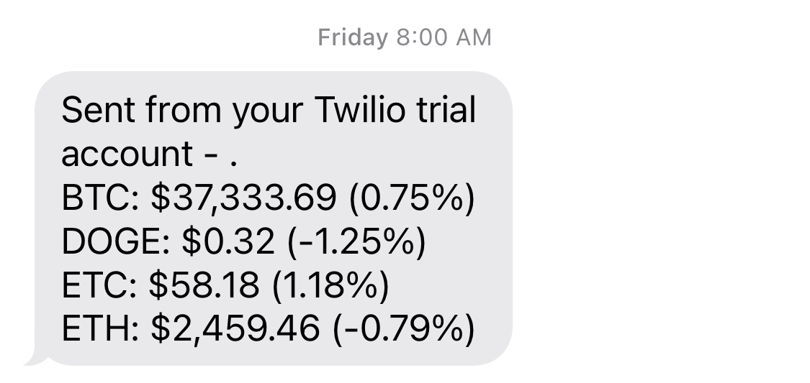
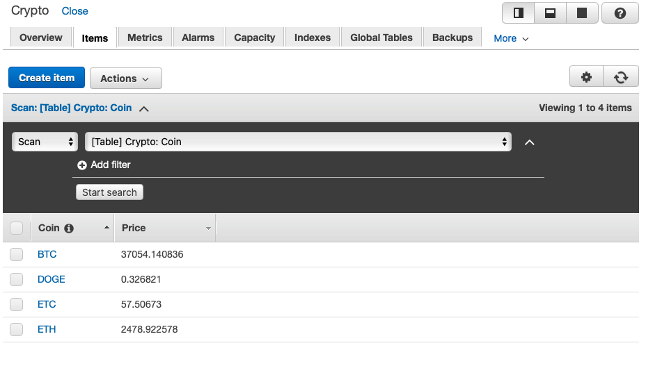

# CryptoTextAlert
A pair of AWS Lambda functions to send an SMS message with the price and percent change of Bitcoin, Dogecoin, Ethereum Classic, and Ethereum. This program uses AWS Lambda, AWS DynamoDB, Coinlayer Price API, and Twilio. (all use the free tiers)

## Cryptocurrency Price Source
The real-time crypto prices are sourced from Coinlayer. I tested over half a dozen crypto price API providers and Coinlayer was overall the best experience because of its generous free tier, a large library of supported cryptocurrencies, and quality of developer documentation. [Get free API key here. ](https://coinlayer.com?utm_source=FirstPromoter&utm_medium=Affiliate&fpr=damian)(Affiliate Link)

Unlike stocks, cryptocurrency markets are open 24/7 so there is no 'open' price to compare real-time prices to and calculate a percent change in price. The solution to this problem is to get the price at midnight and use that as the cryptocurrency's 'open' price. The few API providers that use this solution to provide 'open' prices charge for premium usage, so I decided to implement this myself by making a second Lambda function called [open.py](/open.py) to get the cryptocurrency price at midnight and store that value in a DynamoDB table to be used later by the main Lambda function called [message.py](/message.py) to calculate the price percent change.

## DynamoDB Setup
Using the AWS web console, create a DynamoDB table with 'Coin' as the key and 'Price' as the sole attribute.

## Lambda Setup
Upload each python script to its own Lambda function with access to DynamoDB resources.

### Configure Environment Variables

1. Coin Layer API Token
2. Twilio Account SID
3. Twilio Phone Number
4. Phone Number to receive the SMS message

### Configure Triggers
Using AWS EventBridge Cron expressions, set the open.py function to run at midnight and the message.py function at anytime that you want to receive price notifications.